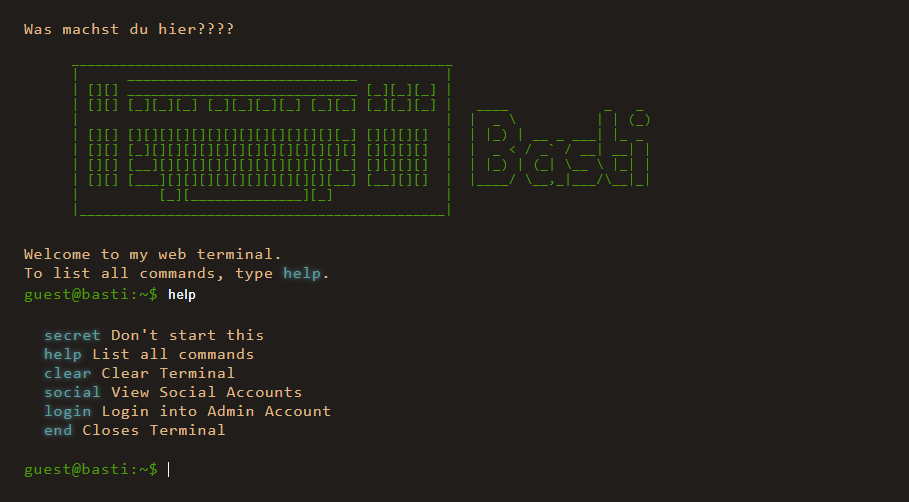

# terminal_website

## A Website that looks like a Linux Terminal made with Vuejs.

The website adopts the appearance of a Linux terminal, featuring a black background with green text to replicate the iconic Linux terminal look. Users can input commands to experience the functionality to a real terminal. The design is minimalistic.

## Screenshots


## How to use this

1. clone this project
2. go into the Folder
3. Execute commands:

```sh
npm install #Install Dependencies

npm run dev #Run for Development

npm run build #Build for Production
```

After that the Website is ready to use. Feel free to make your own Commands, Styles, ...